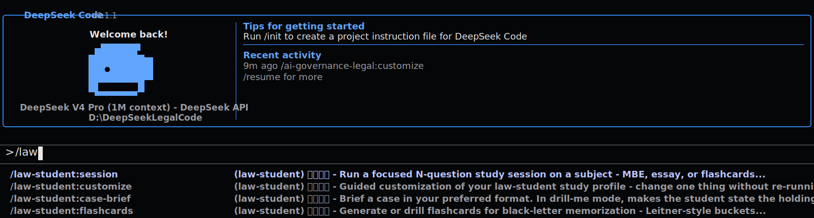

# DeepSeekLegalCode

[简体中文](README.md) | [English](README_EN.md)

DeepSeekLegalCode 是一个面向法律专业工作的本地 CLI Agent。它基于 DeepSeekCode / Claude Code 代码库改造，将模型请求路由到 DeepSeek 的 Anthropic 兼容 API，并在仓库中预配置 `claude-for-legal` 法律插件 marketplace。

> 社区独立项目，非 DeepSeek 或 Anthropic 官方产品。法律插件输出是供律师、法务、教师或学生复核的工作草稿，不构成法律意见。




## 项目定位

- **面向律师开箱即用**：仓库自带 `.deepseek/settings.json`，预注册 `claude-for-legal` marketplace，并默认启用 12 个法律插件。
- **只要求配置 API Key**：使用者只需要设置 `DEEPSEEK_API_KEY`，不需要先理解 marketplace、MCP 或插件安装流程。
- **命令不会混淆**：法律技能统一显示为 `/插件:技能`，例如 `/law-student:case-brief`，避免多个插件都叫 `customize` 时选错。
- **本地优先**：代码、配置、插件缓存和 MCP 连接都在用户本机或用户指定环境中运行。
- **适合开源交付**：中英文 README、法律插件说明、集成设计、测试和密钥泄露检查路径都在仓库中。

## 快速开始

```powershell
git clone https://github.com/TracyWang95/DeepSeekLegalCode.git
cd DeepSeekLegalCode
npm ci --ignore-scripts
npm run check
```

配置 DeepSeek API Key：

```powershell
$env:DEEPSEEK_API_KEY="sk-..."
```

启动交互界面：

```powershell
node scripts/run-deepseek.mjs
```

进入界面后输入 `/` 浏览命令。法律插件命令会以 `/插件:技能` 显示，例如：

```text
/commercial-legal:review 审查当前目录里的合同，列出高风险条款、修改建议和需要人工确认的问题。
/privacy-legal:use-case-triage 判断一个 AI 产品功能的隐私风险，并先追问必要事实。
/law-student:case-brief 帮我做这个案例的 case brief，并指出 holding 和 rule。
```

## 法律插件

这里的“插件”不是法律部门分类，而是上游 `claude-for-legal` 的实践包。一个插件定义一个工作面、配置文件和一组二级 skills；真正执行的动作是 `/插件:技能`。完整二级技能请运行 `node scripts/run-deepseek.mjs legal commands <plugin>` 查看。

本仓库默认启用 12 个 `claude-for-legal` 插件包：

| 插件包 | 边界 / 面向对象 | 真实二级技能范围 | 推荐入口 |
| --- | --- | --- | --- |
| `commercial-legal` | 商业合同运营：供应商协议、NDA、SaaS 订阅、续约和升级流转；不是泛商事咨询。 | `review`, `nda-review`, `saas-msa-review`, `vendor-agreement-review`, `renewal-tracker`, `stakeholder-summary` | `/commercial-legal:review` |
| `privacy-legal` | 隐私工作流：PIA/DPIA 判断、DPA、DSAR、政策与实践漂移；不是全部数据法问题。 | `use-case-triage`, `pia-generation`, `dpa-review`, `dsar-response`, `policy-monitor`, `reg-gap-analysis` | `/privacy-legal:use-case-triage` |
| `product-legal` | 产品上线法务：功能、发布、营销声明和快速问题分流；适合产品团队日常问答。 | `is-this-a-problem`, `feature-risk-assessment`, `launch-review`, `marketing-claims-review` | `/product-legal:is-this-a-problem` |
| `corporate-legal` | 公司交易与治理：M&A 尽调、交割、董事会文件、主体合规；不是普通公司百科。 | `diligence-issue-extraction`, `tabular-review`, `closing-checklist`, `board-minutes`, `entity-compliance` | `/corporate-legal:diligence-issue-extraction` |
| `employment-legal` | 劳动雇佣和 HR 合规：招聘、解雇、分类、休假、调查、制度；需要结合司法辖区。 | `hiring-review`, `termination-review`, `worker-classification`, `wage-hour-qa`, `leave-tracker`, `policy-drafting` | `/employment-legal:wage-hour-qa` |
| `regulatory-legal` | 监管监控与政策差距：监管动态、政策 diff、缺口、意见稿和政策改写。 | `reg-feed-watcher`, `policy-diff`, `gap-surfacer`, `gaps`, `comments`, `policy-redraft` | `/regulatory-legal:reg-feed-watcher` |
| `ai-governance-legal` | AI 治理：AI 用例、影响评估、清单、供应商 AI 条款和内部 AI 政策。 | `use-case-triage`, `aia-generation`, `ai-inventory`, `vendor-ai-review`, `policy-starter`, `reg-gap-analysis` | `/ai-governance-legal:use-case-triage` |
| `litigation-legal` | 诉讼与争议：事项接入、legal hold、时间线、claim chart、证据开示和律所/法务状态汇报。 | `matter-intake`, `legal-hold`, `chronology`, `claim-chart`, `privilege-log-review`, `subpoena-triage` | `/litigation-legal:matter-intake` |
| `ip-legal` | 知识产权实务：商标清查、FTO 初筛、开源合规、IP 条款、侵权分流和组合管理。 | `clearance`, `fto-triage`, `oss-review`, `ip-clause-review`, `infringement-triage`, `portfolio` | `/ip-legal:clearance` |
| `legal-clinic` | 法律诊所教学：接案、研究路线、文书、导师审阅、期限和学期交接；不是普通律所 CRM。 | `client-intake`, `research-start`, `memo`, `client-letter`, `supervisor-review-queue`, `semester-handoff` | `/legal-clinic:research-start` |
| `law-student` | 法学院学习：苏格拉底问答、案例摘要、cold call、IRAC、记忆卡、考试准备；学习模式，不替学生交答案。 | `session`, `case-brief`, `cold-call-prep`, `irac-practice`, `flashcards`, `study-plan`, `exam-forecast` | `/law-student:case-brief` |
| `legal-builder-hub` | 法律插件生态管理：浏览、安装、更新、质检社区法律技能；它本身不做法律分析。 | `registry-browser`, `skill-installer`, `skill-manager`, `skills-qa`, `auto-updater`, `disable` | `/legal-builder-hub:registry-browser` |

列出所有插件：

```powershell
node scripts/run-deepseek.mjs legal list
```

列出某个插件下的全部二级技能：

```powershell
node scripts/run-deepseek.mjs legal commands law-student
```

检查本地插件安装状态：

```powershell
node scripts/run-deepseek.mjs legal doctor
```

`legal doctor` 会同步项目声明的 marketplace 和已启用插件到本地插件缓存，适合在新机器或新 clone 后先运行一次。

## MCP 怎么用

MCP 是可选增强能力。法律插件可以通过 MCP 读取本地文件夹、知识库、文档系统、研究系统或团队工具。

查看当前 MCP：

```powershell
node scripts/run-deepseek.mjs mcp list
```

添加一个本地文件系统 MCP：

```powershell
node scripts/run-deepseek.mjs mcp add filesystem -- npx -y @modelcontextprotocol/server-filesystem D:\Contracts
```

然后在法律命令里明确让它读取资料目录：

```text
/commercial-legal:review 使用 filesystem MCP 读取 D:\Contracts，审查合同并输出风险表。
```

## 项目结构

```text
.deepseek/settings.json               # 预注册 claude-for-legal 并启用 12 个法律插件
docs/legal-plugins.zh-CN.md           # 中文法律插件说明
docs/legal-plugins.md                 # 英文法律插件说明
docs/legal-integration-design.md      # 集成设计
docs/assets/law-student-slash-menu.svg
scripts/run-deepseek.mjs              # DeepSeek 启动器
scripts/legal-marketplace.test.mjs    # 法律插件集成测试
src/cli/handlers/legal.ts             # legal 子命令
src/utils/plugins/legalMarketplace.ts # 法律插件元数据和中文标签
```

## 常用开发命令

```powershell
npm run check
npm test
node scripts/run-deepseek.mjs legal doctor
node scripts/run-deepseek.mjs legal commands law-student
```

## 安全说明

- 不要把 DeepSeek API Key 写入仓库、README、issue、截图或日志。
- 仓库只记录公开 marketplace 来源：`anthropics/claude-for-legal`。
- 法律输出默认是草稿，需要合格律师、法务负责人、教师或导师复核。
- 对最新法律、监管、判例、有效日期、金额阈值等内容，应使用可靠来源或研究工具重新核验。

## 许可证

MIT。上游 Claude Code / Claude for Legal 相关商标、代码和内容归各自权利人所有。
